The purpose of this script is to format your server's existing *.cfg file to be compatible with the "script.js" that reads the "cvars.json" file

The "script.js" reads from the "cvars.json", so for any commands to show up they must be correctly formatted in the "cvars.json" file.

1. Copy / paste your existing *.cfg file to the "python/cfg" folder.

2. Open **cmd.exe** in this folder: (/CS2_CFG/python/cmd.exe)

3. Copy this command, replace the arguments and paste it into the cmd window:

"python commands.py **from** **to**

Example: *python commands.py cfg/gamemode_custom.cfg output.json*

Input file: "gamemode_custom.cfg"
Output file: "output.json"

4. Copy/paste the contents of "python/output.json" to your "js/cvars.json", your custom .cfg should now show up in the GUI.

```mermaid
flowchart TD
    A[Open &quot;python&quot; folder] --> B[Copy existing .cfg file to &quot;python/cfg&quot; folder]
    B --> C[Open cmd.exe in &quot;python&quot; folder]
    C --> D[Run &quot;python commands.py input.cfg output.json&quot;]
    D --> E[Script reformats .cfg file to .json]
    E --> F[Copy the contents of output.json to cvars.json]
    F --> G[Commands now show up in GUI]
    
    D --> I[Example:<br/>&quot;python commands.py cfg/gamemode_custom.cfg output.json&quot;]
    I --> E
    
    style A fill:#111c28
    style B fill:#223850
    style C fill:#111c28
    style D fill:#223850
    style E fill:#724643
    style F fill:#4c4843
    style G fill:#615b62
    style I fill:#111925, width:350px
```

